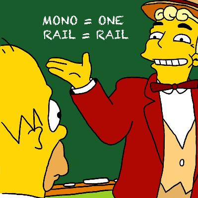

Generalized Additive Models
============================
author: Noam Ross (with lots of slides by David L Miller)
css: custom.css
transition: none


Overview
=========

- Motivation
- Getting our feet wet with an example
- What is a GAM?
- What is smoothing?
- How do GAMs work? (*Roughly*)


```{r setup, include=FALSE}
library(knitr)
library(viridis)
library(ggplot2)
library(reshape2)
library(animation)
library(mgcv)
opts_chunk$set(cache=TRUE, echo=FALSE)
```

What is a GAM?
===============
type:section

Generalized Additive Models
============================

- Generalized =  many response distributions
- Additive = terms **add** together
- Models = Models

Generalized Additive Models
============================
right:50%

- Generalized =  many response distributions
- Additive = terms **add** together
- Models = Models

***




To GAMs from GLMs and LMs
=============================
type:section


(Generalized) Linear Models
=============================

Models that look like:

$$
y_i = \beta_0 + x_{1i}\beta_1 + x_{2i}\beta_2 + \ldots + \epsilon_i
$$

(describe the response, $y_i$, as linear combination of the covariates, $x_{ji}$, with an offset)

We can make $y_i\sim$ any exponential family distribution (Normal, Poisson, etc).

Error term $\epsilon_i$ is normally distributed (usually).

Why bother with anything more complicated?!
=============================
type:section

Is this linear?
=============================

```{r islinear, fig.width=12, fig.height=6}
set.seed(2) ## simulate some data...
dat <- gamSim(1, n=400, dist="normal", scale=1, verbose=FALSE)
dat <- dat[,c("y", "x0", "x1", "x2", "x3")]
p <- ggplot(dat,aes(y=y,x=x1)) +
      geom_point() +
      theme_minimal()
print(p)
```

Is this linear? Maybe?
=============================

```{r eval=FALSE, echo=TRUE}
lm(y ~ x1, data=dat)
```


```{r maybe, fig.width=12, fig.height=6}
p <- ggplot(dat, aes(y=y, x=x1)) + geom_point() +
      theme_minimal()
print(p + geom_smooth(method="lm"))
```


What can we do?
=============================
type:section

Adding a quadratic term?
=============================

```{r eval=FALSE, echo=TRUE}
lm(y ~ x1 + poly(x1, 2), data=dat)
```

```{r quadratic, fig.width=12, fig.height=6}
p <- ggplot(dat, aes(y=y, x=x1)) + geom_point() +
      theme_minimal()
print(p + geom_smooth(method="lm", formula=y~x+poly(x, 2)))
```


Is this sustainable?
=============================

- Adding in quadratic (and higher terms) *can* make sense
- This feels a bit *ad hoc*
- Better if we had a **framework** to deal with these issues?

```{r ruhroh, fig.width=12, fig.height=6}
p <- ggplot(dat, aes(y=y, x=x2)) + geom_point() +
      theme_minimal()
print(p + geom_smooth(method="lm", formula=y~x+poly(x, 2)))
```


[drumroll]
=============================
type:section


What does a model look like?
=============================

$$
y_i = \beta_0 + \sum_j s_j(x_{ji}) + \epsilon_i
$$

where $\epsilon_i \sim N(0, \sigma^2)$, $y_i \sim \text{Normal}$ (for now)

Remember that we're modelling the mean of this distribution!

Call the above equation the **linear predictor**


Okay, but what about these "s" things?
======================================
right:45%

- Think $s$=**smooth**
- Want to model the covariates flexibly
- Covariates and response not necessarily linearly related!
- Want some "wiggles"

---

```{r smoothdat, fig.width=8, fig.height=8}

spdat <- melt(dat, id.vars = c("y"))
p <- ggplot(spdat,aes(y=y,x=value)) +
      geom_point() +
      theme_minimal() +
      facet_wrap(~variable, nrow=2)
print(p)
```


Okay, but what about these "s" things?
======================================
right:45%

- Think $s$=**smooth**
- Want to model the covariates flexibly
- Covariates and response not necessarily linearly related!
- Want some "wiggles"

---

```{r wsmooths, fig.width=8, fig.height=8}
p <- p + geom_smooth()
print(p)
```


What is smoothing?
===============
type:section


Straight lines vs. interpolation
=================================
right:55%

```{r wiggles, fig.height=8, fig.width=8}
library(mgcv)
# hacked from the example in ?gam
set.seed(2) ## simulate some data... 
dat <- gamSim(1,n=50,dist="normal",scale=0.5, verbose=FALSE)
dat$y <- dat$f2 + rnorm(length(dat$f2), sd = sqrt(0.5))
f2 <- function(x) 0.2*x^11*(10*(1-x))^6+10*(10*x)^3*(1-x)^10-mean(dat$y)
ylim <- c(-4,6)

# fit some models
b.justright <- gam(y~s(x2),data=dat)
b.sp0 <- gam(y~s(x2, sp=0, k=50),data=dat)
b.spinf <- gam(y~s(x2),data=dat, sp=1e10)

curve(f2,0,1, col="blue", ylim=ylim)
points(dat$x2, dat$y-mean(dat$y))

```
***
- Want a line that is "close" to all the data
- Don't want interpolation -- we know there is "error"
- Balance between interpolation and "fit"

Splines
========

- Functions made of other, simpler functions
- **Basis functions** $b_k$, estimate $\beta_k$ 
- $s(x) = \sum_{k=1}^K \beta_k b_k(x)$
- Makes the math(s) much easier


Design matrices
===============

- We often write models as $X\boldsymbol{\beta}$
  - $X$ is our data
  - $\boldsymbol{\beta}$ are parameters we need to estimate
- For a GAM it's the same
  - $X$ has columns for each basis, evaluated at each observation
  - again, this is the linear predictor
  
Measuring wigglyness
======================

- Visually:
  - Lots of wiggles == NOT SMOOTH
  - Straight line == VERY SMOOTH
- How do we do this mathematically?
  - Derivatives!
  - (Calculus *was* a useful class afterall!)


Wigglyness by derivatives
==========================

```{r wigglyanim, results="hide"}
library(numDeriv)
f2 <- function(x) 0.2*x^11*(10*(1-x))^6+10*(10*x)^3*(1-x)^10 - mean(dat$y)

xvals <- seq(0,1,len=100)

plot_wiggly <- function(f2, xvals){

  # pre-calculate
  f2v <- f2(xvals)
  f2vg <- grad(f2,xvals)
  f2vg2 <- unlist(lapply(xvals, hessian, func=f2))
  f2vg2min <- min(f2vg2) -2
  
  # now plot
  for(i in 1:length(xvals)){
    par(mfrow=c(1,3))
    plot(xvals, f2v, type="l", main="function", ylab="f")
    points(xvals[i], f2v[i], pch=19, col="red")
    
    plot(xvals, f2vg, type="l", main="derivative", ylab="df/dx")
    points(xvals[i], f2vg[i], pch=19, col="red")
    
    plot(xvals, f2vg2, type="l", main="2nd derivative", ylab="d2f/dx2")
    points(xvals[i], f2vg2[i], pch=19, col="red")
    polygon(x=c(0,xvals[1:i], xvals[i],f2vg2min),
            y=c(f2vg2min,f2vg2[1:i],f2vg2min,f2vg2min), col = "grey")
    
    ani.pause()
  }
}

saveGIF(plot_wiggly(f2, xvals), "wiggly.gif", interval = 0.2, ani.width = 800, ani.height = 400)
```


What was that grey bit?
=========================

$$
\int_\mathbb{R} \left( \frac{\partial^2 f(x)}{\partial^2 x}\right)^2 \text{d}x\\
$$

(Take some derivatives of the smooth and integrate them over $x$)

(*Turns out* we can always write this as $\boldsymbol{\beta}^\text{T}S\boldsymbol{\beta}$, so the $\boldsymbol{\beta}$ is separate from the derivatives)

(Call $S$ the **penalty matrix**)

Making wigglyness matter
=========================

- $\boldsymbol{\beta}^\text{T}S\boldsymbol{\beta}$ measures wigglyness
- "Likelihood" measures closeness to the data
- Penalise closeness to the data...
- Use a **smoothing parameter** to decide on that trade-off...
  - $\lambda \beta^\text{T}S\beta$
- Estimate the $\beta_k$ terms but penalise objective
  - "closeness to data" + penalty

Smoothing parameter
=======================


```{r wiggles-plot, fig.width=15}
# make three plots, w. estimated smooth, truth and data on each
par(mfrow=c(1,3), cex.main=3.5)

plot(b.justright, se=FALSE, ylim=ylim, main=expression(lambda*plain("= just right")))
points(dat$x2, dat$y-mean(dat$y))
curve(f2,0,1, col="blue", add=TRUE)

plot(b.sp0, se=FALSE, ylim=ylim, main=expression(lambda*plain("=")*0))
points(dat$x2, dat$y-mean(dat$y))
curve(f2,0,1, col="blue", add=TRUE)

plot(b.spinf, se=FALSE, ylim=ylim, main=expression(lambda*plain("=")*infinity)) 
points(dat$x2, dat$y-mean(dat$y))
curve(f2,0,1, col="blue", add=TRUE)

```

Smoothing parameter selection
==============================

- Many methods: AIC, Mallow's $C_p$, GCV, ML, REML
- Recommendation, based on simulation and practice:
  - Use REML or ML
  - Reiss \& Ogden (2009), Wood (2011)
  


Maximum wiggliness
========================

- We can set **basis complexity** or "size" ($k$)
  - Maximum wigglyness
- Smooths have **effective degrees of freedom** (EDF)
- EDF < $k$
- Set $k$ "large enough"
  - Penalty does the rest


More on this in a bit...

uhoh
======
title: none
type:section

<p align="center"></p>

GAM summary
===========

- Straight lines suck --- we want **wiggles**
- Use little functions (**basis functions**) to make big functions (**smooths**)
- Need to make sure your smooths are **wiggly enough**
- Use a **penalty** to trade off wiggliness/generality 


Fitting GAMs in practice
=========================
type:section

Translating maths into R
==========================

A simple example:

$$
y_i = \beta_0 + s(x) + s(w) + \epsilon_i
$$

where $\epsilon_i \sim N(0, \sigma^2)$

Let's pretend that $y_i \sim \text{Normal}$

- linear predictor: `formula = y ~ s(x) + s(w)`
- response distribution: `family=gaussian()`
- data: `data=some_data_frame` 

Putting that together
======================

```{r echo=TRUE, eval=FALSE}
my_model <- gam(y ~ s(x) + s(w),
                family = gaussian(),
                data = some_data_frame,
                method = "REML")
```

- `method="REML"` uses REML for smoothness selection (default is `"GCV.Cp"`)

What about a practical example?
================================
type:section

