Beyond the exponential family
============================
author: Eric Pedersen, Gavin Simpson, David Miller, Noam Ross
date:  August 5th, 2018
css: custom.css
transition: none


Away from the exponential family
===================================
incremental: true

Most glm families (Poisson, Gamma, Gaussian, Binomial) are *exponential families*

$$ f(x|\theta) \sim exp(\sum_i \eta_i(\theta)T_i(x) - A(\theta))$$

- Computationally easy
- Has sufficient statistics: easier to estimate parameter variance
- ... but it doesn't describe everything
- `mgcv` has expanded to cover many new families
- Lets you model a much wider range of scenarios with smooths


What we'll cover
===================================

- "Counts": Negative binomial and Tweedie distributions
- Modelling proportions with the Beta distribution
- Robust regression with the Student's t distribution
- Ordered and unorderd categorical data
- Multivariate normal data
- Modelling exta zeros with zero-inflated and adjusted families

- _NOTE_: All the distributions we're covering here have their own quirks. Read 
the help files carefully before using them!

Modelling "counts"
================
type:section

Counts and count-like things
============================

- Response is a count (not always integer)
- Often, it's mostly zero (that's complicated)
- Could also be catch per unit effort, biomass etc
- Flexible mean-variance relationship


Tweedie distribution
=====================

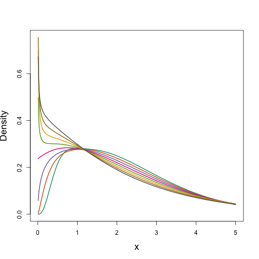
***
-  $\text{Var}\left(\text{count}\right) = \phi\mathbb{E}(\text{count})^q$
- Common distributions are sub-cases:
  - $q=1 \Rightarrow$ Poisson
  - $q=2 \Rightarrow$ Gamma
  - $q=3 \Rightarrow$ Normal
- We are interested in $1 < q < 2$ 
- (here $q = 1.2, 1.3, \ldots, 1.9$)
- `tw()`


Negative binomial
==================

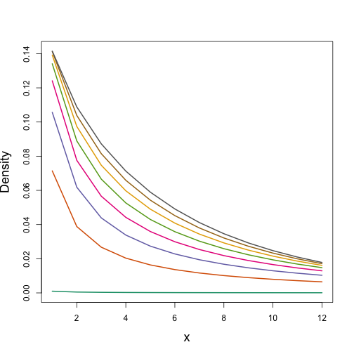
***
- $\text{Var}\left(\text{count}\right) =$ $\mathbb{E}(\text{count}) + \kappa \mathbb{E}(\text{count})^2$
- Estimate $\kappa$
- Is quadratic relationship a "strong" assumption?
- Similar to Poisson: $\text{Var}\left(\text{count}\right) =\mathbb{E}(\text{count})$ 
- `nb()`


Modelling proportions
======================
type:section 

The Beta distribution
======================

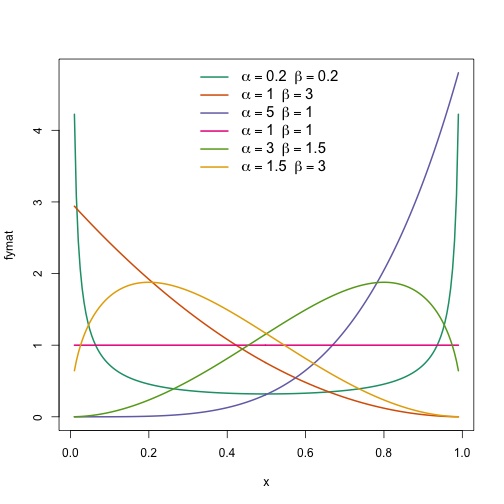

***

- Proportions; continuous, bounded at 0 & 1
- Beta distribution is convenient choice
- Two strictly positive shape parameters, $\alpha$ & $\beta$
- Has support on $x \in (0,1)$
- Density at $x = 0$ & $x = 1$ is $\infty$, fudge
- **betareg** package
- `betar()` family in **mgcv**

Beta or Binomial?
=================

The binomial model also model's proportions --- more specifically it models the number of successes in $m$ trials. If you have data of this form then model the binomial counts as this can yield predicted *counts* if required.

If you have true percentage or proportion data, say estimated proportional plant cover in a quadrat, then the beta model is appropriate.

Also, if all you have is the percentages, the beta model is unlikely to be terribly bad.

Stereotypic behaviour in captive cheetahs
=========================================

To illustrate the use of the `betar()` family in **mgcv** we use a behavioural data set of observations on captive cheetahs. These data are provided and extensively analysed in Zuur et al () and originate from Quirke et al (2012).

Stereotypic behaviour in captive cheetahs
=========================================

- data collected from nine zoos
- at randomised times of day a random number of scans (videos) of captive cheetah behaviour were recorded and analysed over a period of several months
- presence of stereotypical behaviour was recorded
- all individuals in an enclosure were assessed; where more than 1 individual data were aggregated over individuals to achieve 1 data point per enclosure per sampling occasion
- a number of covariates were also recorded
- data technically a binomial counts but we'll ignore count data and model the proportion of scans showing stereotypical behaviour

Cheetah: data processing
========================


```r
cheetah <- read.table("../data/beta-regression/ZooData.txt", header = TRUE)
names(cheetah)
```

```
 [1] "Number"     "Scans"      "Proportion" "Size"       "Visual"    
 [6] "Raised"     "Visitors"   "Feeding"    "Oc"         "Other"     
[11] "Enrichment" "Group"      "Sex"        "Enclosure"  "Vehicle"   
[16] "Diet"       "Age"        "Zoo"        "Eps"       
```

```r
cheetah <- transform(cheetah, Raised = factor(Raised),
                     Feeding = factor(Feeding),
                     Oc = factor(Oc),
                     Other = factor(Other),
                     Enrichment = factor(Enrichment),
                     Group = factor(Group),
                     Sex = factor(Sex, labels = c("Male","Female")),
                     Zoo = factor(Zoo))
```

Cheetah: model fitting
======================


```r
m <- gam(Proportion ~ s(log(Size)) + s(Visitors) + s(Enclosure) +
           s(Vehicle) + s(Age) + s(Zoo, bs = "re") + 
           Feeding + Oc + Other + Enrichment + Group + Sex,
         data = cheetah, family = betar(), method = "REML")
```

Cheetah: model summary
======================
title: false


```

Family: Beta regression(14.008) 
Link function: logit 

Formula:
Proportion ~ s(log(Size)) + s(Visitors) + s(Enclosure) + s(Vehicle) + 
    s(Age) + s(Zoo, bs = "re") + Feeding + Oc + Other + Enrichment + 
    Group + Sex

Parametric coefficients:
            Estimate Std. Error z value Pr(>|z|)    
(Intercept) -2.62169    0.28642  -9.153  < 2e-16 ***
Feeding2    -0.47017    0.24004  -1.959 0.050150 .  
Oc2          0.89373    0.23419   3.816 0.000135 ***
Other2      -0.08821    0.22064  -0.400 0.689298    
Enrichment2 -0.17822    0.24557  -0.726 0.468000    
Group2      -0.57575    0.21491  -2.679 0.007383 ** 
SexFemale    0.16166    0.17415   0.928 0.353278    
---
Signif. codes:  0 '***' 0.001 '**' 0.01 '*' 0.05 '.' 0.1 ' ' 1

Approximate significance of smooth terms:
                   edf Ref.df Chi.sq  p-value    
s(log(Size)) 2.8849324  3.606 27.686 1.23e-05 ***
s(Visitors)  1.0000413  1.000  0.088  0.76717    
s(Enclosure) 1.6013748  1.979  1.177  0.51516    
s(Vehicle)   1.0000770  1.000  7.391  0.00656 ** 
s(Age)       1.0008134  1.002  7.217  0.00726 ** 
s(Zoo)       0.0000135  8.000  0.000  0.62532    
---
Signif. codes:  0 '***' 0.001 '**' 0.01 '*' 0.05 '.' 0.1 ' ' 1

R-sq.(adj) =  0.289   Deviance explained =  102%
-REML = -170.92  Scale est. = 1         n = 88
```

Cheetah: model smooths
======================

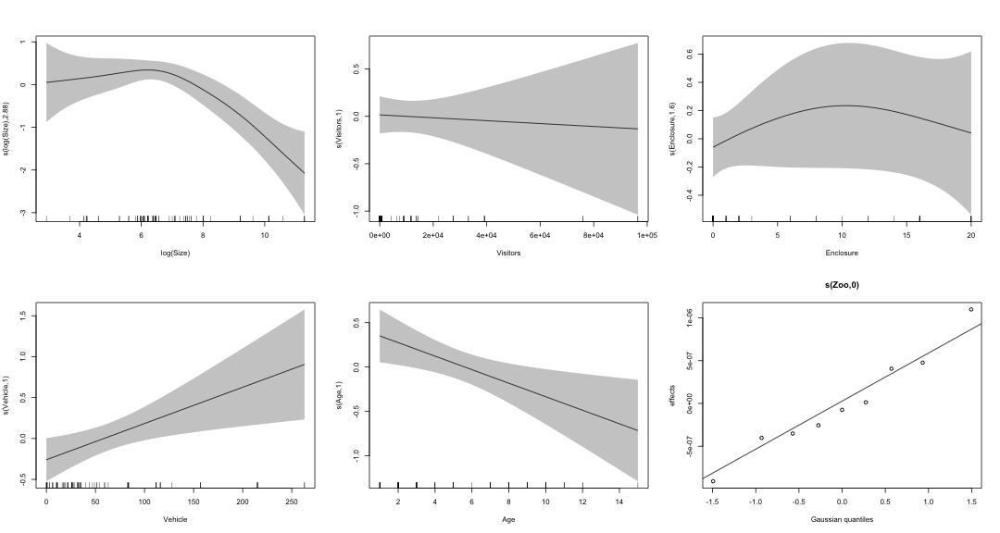

Modelling outliers
====================
type:section

The student-t distribution
============================
- Models continuous data w/ longer tails than normal
- Far less sensitive to outliers
- Has one extra parameter: df. 
- bigger df: t dist approaches normal


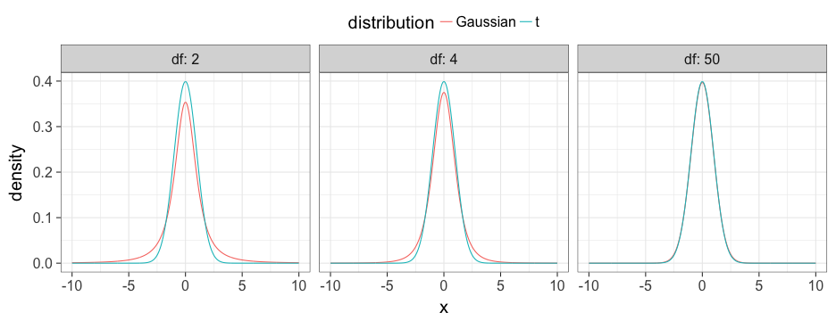


The student-t distribution: Usage
============================

```r
set.seed(4)
n=300
dat = data.frame(x=seq(0,10,length=n))
dat$f = 20*exp(-dat$x)*dat$x
dat$y  = 1*rt(n,df = 3) + dat$f
norm_mod =  gam(y~s(x,k=20), data=dat, family=gaussian(link="identity"))
t_mod = gam(y~s(x,k=20), data=dat, family=scat(link="identity"))
```

The student-t distribution: Usage
============================
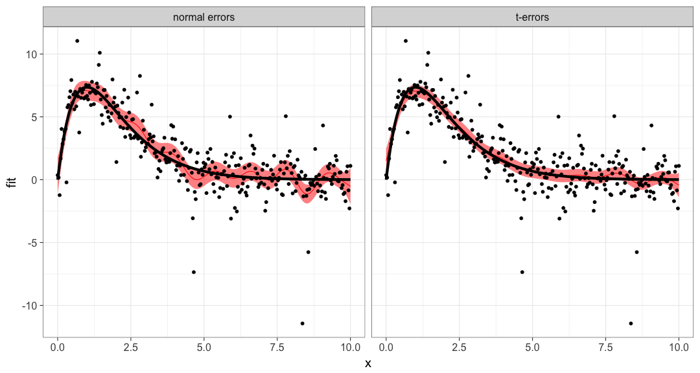


The student-t distribution: Usage
============================

```

Family: Scaled t(2.976,0.968) 
Link function: identity 

Formula:
y ~ s(x, k = 20)

Parametric coefficients:
            Estimate Std. Error z value Pr(>|z|)    
(Intercept)  2.02664    0.06853   29.57   <2e-16 ***
---
Signif. codes:  0 '***' 0.001 '**' 0.01 '*' 0.05 '.' 0.1 ' ' 1

Approximate significance of smooth terms:
       edf Ref.df Chi.sq p-value    
s(x) 13.27  15.71   1221  <2e-16 ***
---
Signif. codes:  0 '***' 0.001 '**' 0.01 '*' 0.05 '.' 0.1 ' ' 1

R-sq.(adj) =  0.695   Deviance explained = 63.1%
-REML = 546.75  Scale est. = 1         n = 300
```


Modelling multi-dimensional data 
===========================
type:section

Ordered categorical data 
===========================
- Assumes data are in discrete categories, and categories fall in order
- e.g.: conservation status: "least concern", "vulnerable", "endangered", "extinct"
- fits a linear latent model using covariates, w/ threshold for each level
- First cut-off always occurs at -1 


Ordered categorical data 
===========================
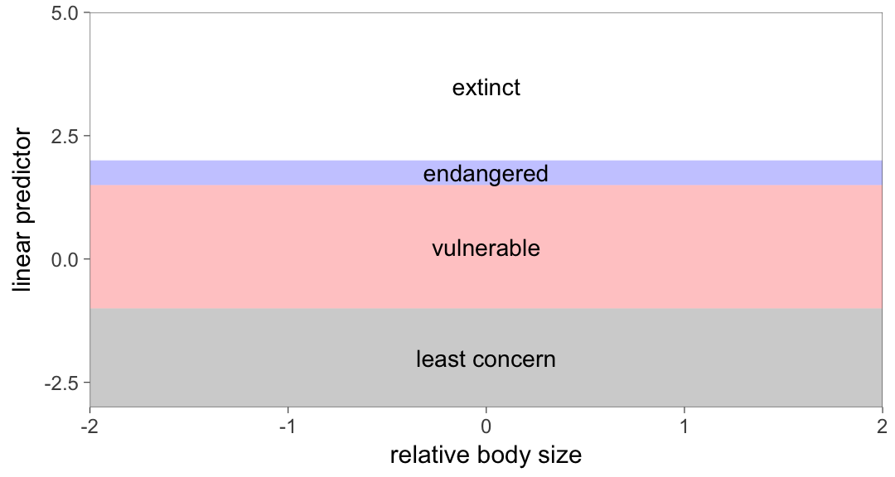


Ordered categorical data 
===========================
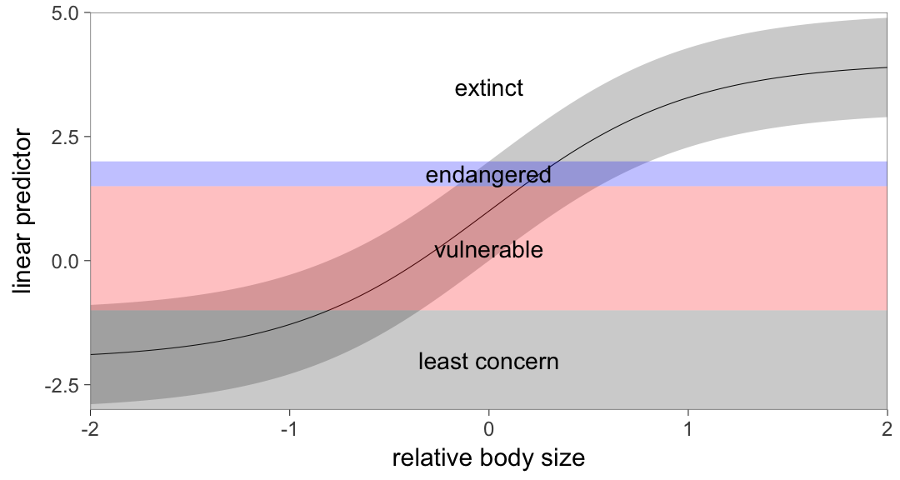


Using ocat
===========================

```r
n= 200
dat = data.frame(x1 = runif(n,-1,1),x2=2*pi*runif(n))
dat$f = dat$x1^2 + sin(dat$x2)
dat$y_latent = dat$f + rnorm(n,dat$f)
dat$y = ifelse(dat$y_latent<0,1, ifelse(dat$y_latent<0.5,2,3))
ocat_model = gam(y~s(x1)+s(x2), family=ocat(R=3),data=dat)
plot(ocat_model,page=1)
```

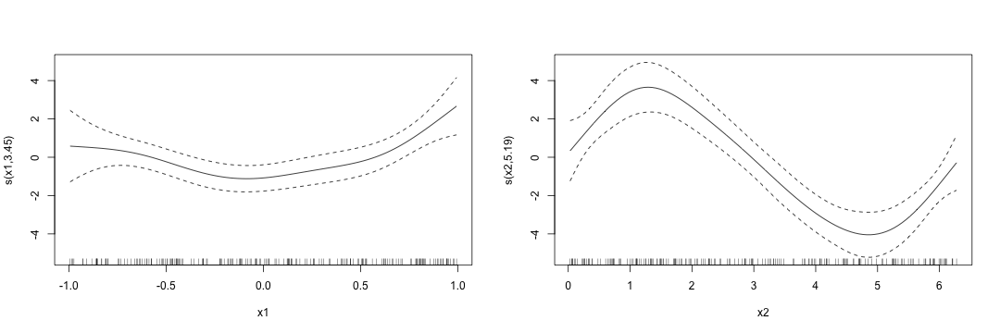

Using ocat
===========================

```r
summary(ocat_model)
```

```

Family: Ordered Categorical(-1,-0.09) 
Link function: identity 

Formula:
y ~ s(x1) + s(x2)

Parametric coefficients:
            Estimate Std. Error z value Pr(>|z|)  
(Intercept)   0.5010     0.2792   1.794   0.0727 .
---
Signif. codes:  0 '***' 0.001 '**' 0.01 '*' 0.05 '.' 0.1 ' ' 1

Approximate significance of smooth terms:
        edf Ref.df Chi.sq  p-value    
s(x1) 3.452  4.282  18.67  0.00133 ** 
s(x2) 5.195  6.270  84.34 1.09e-15 ***
---
Signif. codes:  0 '***' 0.001 '**' 0.01 '*' 0.05 '.' 0.1 ' ' 1

Deviance explained = 57.7%
-REML =  97.38  Scale est. = 1         n = 200
```

Using ocat
===========================
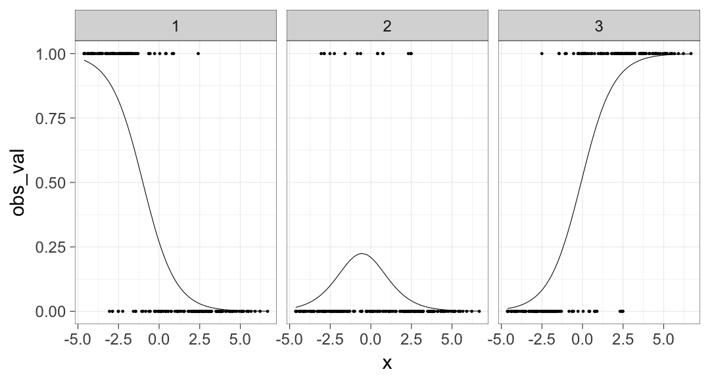

Unordered categorical data 
===========================
- What do you do if categorical data doesn't fall in a nice order? 
 
 
 Unordered categorical data 
===========================

- Model probability of a category occuring relative to an (arbitrary) reference level
- one linear equation for each category except the reference class
- $p(y=i|\mathbf{x}) = exp(\mu_i(\mathbf{x}))/(1+\sum_j exp(\mu_j(\mathbf{x}))$
- $\mu_i(\mathbf{x}) = s_{1,j}(x_1) + s_{2,j}(x_2)$
- $p(y=0|\mathbf{x})= 1/(1+\sum_j exp(\mu_j(\mathbf{x}))$

  
Using the multinom function
===========================
 
 
 ***
  
 
 
 
Using the multinom function
===========================


```r
head(model_dat)
```

```
  tree_cover road_dist y
1       0.51       8.6 1
2       0.31       9.9 0
3       0.43       8.2 1
4       0.69       2.9 1
5       0.09       0.7 1
6       0.23       5.6 1
```

***
 
 ```r
 pairs(model_dat)
 ```
 
 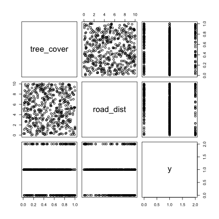

 
Using the multinom function
===========================
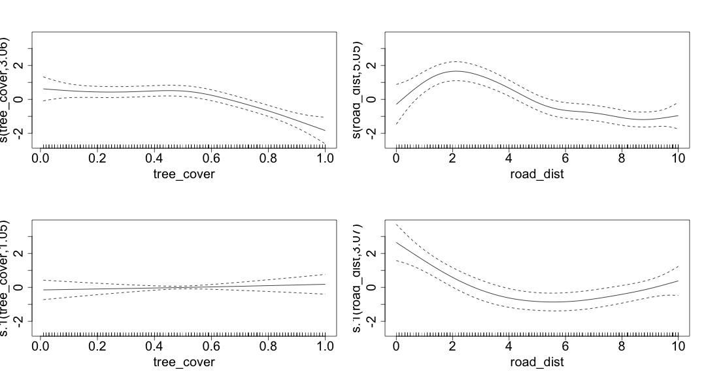


 
Understanding the results
===========================

```r
multinom_pred_data = as.data.frame(expand.grid(road_dist =seq(0,10,length=50),
                                               tree_cover =c(0,0.33,0.66,1)))
multinom_pred = predict(multinom_model, multinom_pred_data,type = "response")
colnames(multinom_pred) = c("monkey","deer","pig")
multinom_pred_data = cbind(multinom_pred_data,multinom_pred)
multinom_pred_data_long = multinom_pred_data %>%
  gather(species, probability, monkey, deer,pig)%>%
  mutate(tree_cover =paste("tree cover = ", tree_cover,sep=""))
ggplot(aes(road_dist, probability,color=species),data=multinom_pred_data_long)+
  geom_line()+
  facet_grid(.~tree_cover)+
  theme_bw(20)
```

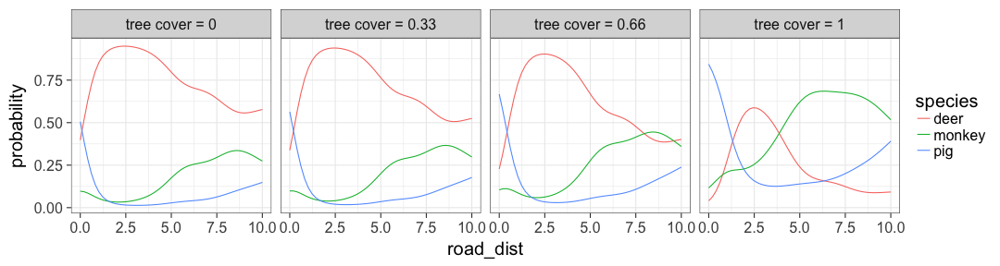


Other multivariate distributions to check out
===================================
type: section


Multivariate normal (family = mvn)
===========================

- Fit a different smooth model for multiple y-variables, but allowing 
  correlation between y's
- Example uses: multi-species distribution models, measuring latent correlations
  between environmental predictors
- mgcv code: formula=list(y1~s(x1)+s(x2), y2 = s(x1)+s(x3)), family = mvn(d=2)

Cox Proportional hazards (family = cox.ph)
===========================

- Censored data: y measures time until an event occurs, or the study was stopped (censoring)
- Measures relative rates, rather than absolute rates (no intercepts)
- Example uses: time until an individual is infected, time until a subpopulation goes 
  extinct, time until lake is invaded
- mgcv code: `formula = y~s(x1)+s(x2), weights= censor.var,family=cox.ph` 
- censor.var = 0 if censored, 1 if not


Gaussian location-scale models (family = gaulss)
===========================

- Model both the mean ("location") and variance ("scale") as smooth functions of predictors 
- Example uses: detecting early warning signs in time series, finding factors driving 
population variability
- mgcv code: `formula = list(y~s(x1)+s(x2), ~s(x2)+s(x3)), family=gaulss`


Zero-inflated Poisson location-scale models (family = ziplss)
===========================

- Models the probability of zeros seperately from mean counts given that you've observed more than zero
at a location.
- Example uses: Counts of prey caught when a predator might switch between not hunting at all (zeros)
and active hunting
- mgcv code: `formula = list(y~s(x1)+s(x2), ~s(x2)+s(x3)), family=ziplss` 


The end of the distribution zoo
==============
type:section 

That's the end of this section! We convene after lunch (1:00 PM). You'll 
get to work through a few more advanced examples of your choice. 


 
